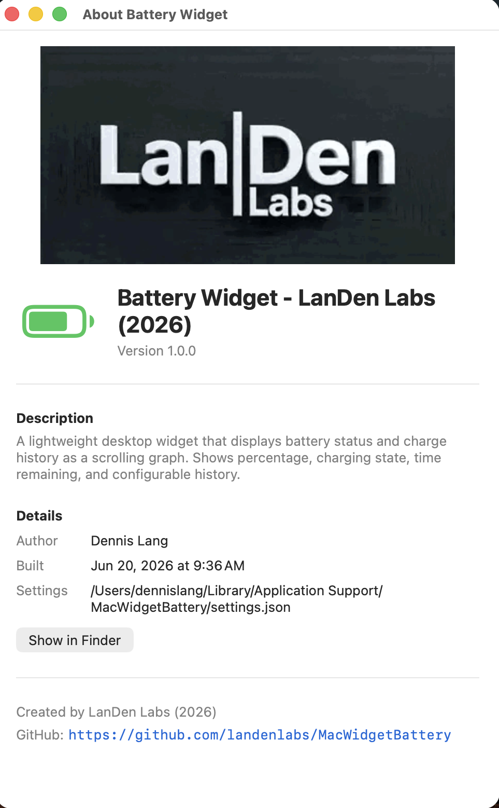
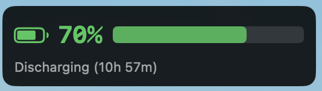
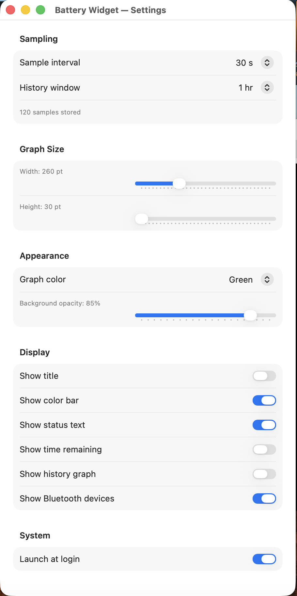

<table border="0">
  <tr>
    <td>
      <!-- VERSION -->v1.0.0
      <!-- DATE -->20-Jun-2026<br>
      macOS<br>
      <a href="https://landenlabs.com">Home</a>
    </td>
    <td>
      <a href="https://landenlabs.com">
        
      </a>
    </td>
  </tr>
</table>

# MacWidgetBattery


A lightweight, transparent **Battery desktop widget** for macOS. Displays live battery percentage, charging state, time remaining, and a scrolling charge history graph as a borderless overlay directly on your desktop wallpaper. Also monitors connected Bluetooth device batteries.

**By [LanDen Labs](https://github.com/landenlabs) (2026)**

---

## Screenshots

**Widget on desktop — battery level, color bar, and discharge duration**



**Widget settings — sampling, graph size, appearance, and display toggles**



**About dialog**


---

## Features

- **Live battery percentage** — large, color-coded readout updates on every sample
- **Charging state indicator** — icon and color change instantly when plugged in or unplugged
- **Color bar** — proportional fill bar shows remaining charge at a glance
- **Status text** — shows Discharging / Charging / Fully Charged / Low Battery / Critical Battery
- **Time remaining** — displays estimated time to empty or time to full charge
- **History graph** — scrolling line graph of charge level over a configurable window (up to hours)
- **Bluetooth device batteries** — lists connected Bluetooth peripherals (keyboard, mouse, AirPods, etc.) with individual battery bars
- **Transparent overlay** — sits directly on the desktop wallpaper; no Dock icon or taskbar clutter
- **Configurable graph color** — Green, Cyan, Blue, Orange, Yellow, or White
- **Adjustable background opacity** — dial in how much of the wallpaper shows through
- **Resizable graph** — width and height sliders in Settings
- **Configurable sample interval** — control polling frequency (affects graph resolution)
- **Configurable history window** — choose how many minutes of history the graph spans
- **Per-display position memory** — widget remembers its position for every monitor layout
- **Drag to reposition** — move the widget via the status bar menu
- **Launch at Login** — optional macOS login item via System Events

---

## Requirements

- macOS 13 (Ventura) or later
- Swift 5.9 / Xcode 15 or later (to build from source)

---

## Installation

### Build from source

```bash
git clone https://github.com/landenlabs/mac-widget-battery.git
cd mac-widget-battery
swift build -c release
```

The built binary is at:
```
.build/release/MacWidgetBattery
```

Run it directly or copy it to `/Applications` or any location in your `PATH`.

---

## Usage

The app runs as a **menu bar accessory** — no Dock icon. After launch, look for the battery icon in the menu bar. The icon color reflects the current battery state.

### Status bar icon colors

| Color | Meaning |
|-------|---------|
| Cyan | Charging or fully charged |
| Green | Battery ≥ 50% |
| Yellow | Battery 20–49% |
| Red | Battery < 20% |
| Gray | No battery detected |

### Status bar menu

| Item | Action |
|------|--------|
| **Move Widget…** | Enables drag mode — drag the widget anywhere on the desktop, then click **Done Moving Widget** to lock |
| **Settings… ⌘,** | Opens the Settings window |
| **About…** | Opens the About dialog |
| **Launch at Login** | Toggles automatic startup at login |
| **Quit ⌘Q** | Quits the app |

---

## Settings

Open Settings via **Settings… (⌘,)** in the status bar menu.

### Sampling

| Field | Description |
|-------|-------------|
| Sample interval | How often battery data is read (seconds). Affects graph resolution and Bluetooth polling. |
| History window | How many minutes of charge history the graph spans. Displayed sample count updates live. |

### Graph Size

| Field | Description |
|-------|-------------|
| Width | Widget width in points (slider) |
| Height | Graph area height in points (slider) |

### Appearance

| Field | Description |
|-------|-------------|
| Graph color | Color of the history graph line and color bar — Green, Cyan, Blue, Orange, Yellow, White |
| Background opacity | Opacity of the dark rounded-rectangle background (0–100%) |

### Display

| Toggle | Description |
|--------|-------------|
| Show title | Display the "🔋 Battery" label at the top |
| Show color bar | Show the proportional charge fill bar next to the percentage |
| Show status text | Show Discharging / Charging / etc. below the percentage |
| Show time remaining | Show estimated time to empty or full |
| Show history graph | Show the scrolling charge level graph |
| Show Bluetooth devices | Show connected Bluetooth devices with their battery levels |

### System

| Toggle | Description |
|--------|-------------|
| Launch at login | Register the app as a macOS login item |

Settings are saved automatically to:
```
~/Library/Application Support/MacWidgetBattery/settings.json
```

The **About** dialog shows the exact path and a **Show in Finder** button.

---

## Building from Source

### Prerequisites

- macOS 13+
- Swift 5.9+ (ships with Xcode 15+) or standalone Swift toolchain
- Xcode Command Line Tools (for `IOKit` and `IOBluetooth` framework headers)

### Build (debug)

```bash
swift build
```

### Build (release)

```bash
swift build -c release
```

### Run directly

```bash
swift run
```

---

## Project Structure

```
mac-widget-battery/
├── Sources/MacWidgetBattery/
│   ├── main.swift                    # Entry point
│   ├── AppDelegate.swift             # Menu bar, window lifecycle, status icon
│   ├── AppState.swift                # Observable state, JSON persistence
│   ├── WidgetConfig.swift            # Settings model, screen fingerprinting
│   ├── BatteryService.swift          # IOKit battery reads (percentage, charge state, cycle count)
│   ├── BatteryMonitor.swift          # Polling timer, sample history
│   ├── BluetoothMonitor.swift        # Bluetooth device discovery and polling
│   ├── BluetoothBatteryService.swift # IOBluetooth battery level reads
│   ├── ContentView.swift             # SwiftUI widget renderer
│   ├── BatteryGraphView.swift        # Scrolling history graph
│   ├── DesktopWindowManager.swift    # Borderless desktop window, drag mode
│   ├── DragOverlayView.swift         # AppKit mouse-event capture for repositioning
│   ├── SettingsView.swift            # Settings window
│   └── AboutView.swift               # About dialog
├── screens/                          # Screenshot assets for README
├── Package.swift
└── README.md
```

---

## Settings File Format

```json
{
  "sampleInterval": 30,
  "historyMinutes": 60,
  "graphWidth": 260,
  "graphHeight": 60,
  "backgroundOpacity": 0.85,
  "graphColor": "Green",
  "showTitle": true,
  "showColorBar": true,
  "showStatusText": true,
  "showTimeRemaining": true,
  "showHistoryGraph": true,
  "showBluetoothDevices": true,
  "positionX": 40,
  "positionY": 400,
  "screenPositions": {
    "2560x1440@0,0": { "x": 40, "y": 400 }
  }
}
```

---

## Credits

| Component | Source |
|-----------|--------|
| Battery data | Apple `IOKit` / `IOPowerSources` |
| Cycle count | `IORegistry` `AppleSmartBattery` service |
| Bluetooth battery | Apple `IOBluetooth` framework |

---

## License

Apache © [LanDen Labs](https://github.com/landenlabs) 2026
